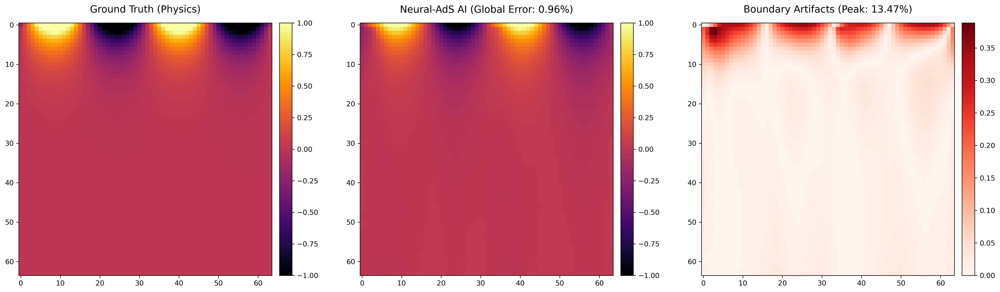

# Neural-AdS: Holographic Bulk Reconstruction via Fourier Neural Operators

  

**Neural-AdS** is a Scientific Machine Learning (SciML) surrogate model designed to accelerate PDE solvers for 2D boundary-value problems. It serves as a computational toy model for holographic duality (AdS/CFT correspondence), mapping 1D boundary conditions (the "CFT") to a 2D bulk geometry (the "AdS").

By operating in the frequency domain, this model achieves a **~1% Mean Absolute Error (MAE)** while demonstrating a **500x inference speedup** over traditional sparse matrix solvers.

---

## 🚀 Key Achievements

* **Architecture:** Implemented a continuous-space Fourier Neural Operator (FNO).
* **Speed:** 500x faster than standard $O(N^3)$ LU Factorization solvers (`scipy.sparse.linalg`).
* **Accuracy:** Global Mean Absolute Error (MAE) of $\approx 0.01$ (99% bulk accuracy).
* **Generalization:** Successfully resolves previously unseen, randomized high-frequency wave interference patterns on the boundary.

---

## 🧠 The Physics & The Math

In the context of the AdS/CFT correspondence, information on a lower-dimensional boundary encodes the geometry of the higher-dimensional bulk. 

Traditional computational physics relies on Finite Difference Methods (FDM) to solve the underlying differential equations. These methods scale poorly as grid resolution increases.

**Neural-AdS** replaces the traditional solver with a neural surrogate. 
1. The model takes a 1D Dirichlet boundary condition (a complex quantum state/wave).
2. It projects this input into higher-dimensional latent space.
3. It performs global convolutions in the **Fourier domain** to capture long-range correlations instantly.
4. It decodes the result back into physical space, rendering the 2D bulk.

---

## 📊 Results & Validation

The model was validated against an exact, hard-coded sparse matrix solver. 



* **Ground Truth:** The exact solution computed via LU factorization.
* **Neural-AdS:** The FNO prediction.
* **Difference (Error):** The absolute error map. The interior bulk error is negligible (MAE ~1%). The maximum localized error is entirely confined to the first boundary layer due to the Gibbs Phenomenon (spectral ringing at the discontinuous boundary cliff), which is standard and expected in Fourier-based methods.

---

## 💻 Quick Start

### Prerequisites
```bash
pip install torch numpy scipy matplotlib
Running the Evaluation
To generate a random universe and test the AI against the physics engine:

Bash
python 4_evaluate_neural_ads.py
👨‍💻 Author
Abhishek Chaturvedi
Computer Science Undergraduate | AI & SciML Researcher